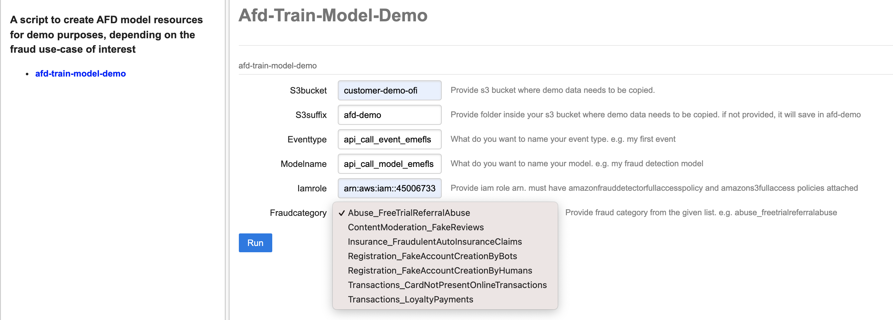

# Amazon Fraud Detector (AFD) Demo Datasets 
 This folder contains **synthetic** datasets that can be used to try out AFD for different fraud use cases.
Use the dataset that you find closest to your business. **Note that**, all datasets are synthetically generated to help you understand the functionalities of the service, and to help create your first set of AFD resources, including `Variables`, `Labels`, `Entity Type`, `Event Type`, and train your first Online Fraud Insights `Model Type`. To actually understand how AFD works in detecting fraud for your use-case, switch to real data.  
  
> #### We also provide a script that can be used to run a local flask app. The app provides you go-to-demo UI that you can use to a train an AFD model, in your AWS account, with just a single click.  
> The script uses [click-web](https://github.com/fredrik-corneliusson/click-web). In order to start using the app, you first need to create an IAM role with *AmazonS3FullAccess* and *AmazonFraudDetectorFullAccessPolicy*, and an S3 bucket where you want synthetic data to be copied in your account. Then, you can start playing with the app and with AFD. Before running, make sure that the AWS CLI is [configured](https://docs.aws.amazon.com/cli/latest/userguide/cli-configure-files.html). In order to use the app, run the following codes from terminal. 

```
cd demo_scripts  # from terminal, first go to demo_scripts sub-folder
# pip install click-web  # uncomment if click-web not installed
export FLASK_ENV=development
export FLASK_APP=app.py
flask run
```

Once the app starts serving (locally), copy-paste the URL from terminal to your web browser, e.g. http://127.0.0.1:5000/. Note that, the app has limitations:
1. It would not work directly from a remote server like EC2. It is created for serving in local machine. 
2. It will also only work for use-cases defined in the repository as it does not take custom input data. The utility of the app is to quickly run an AFD training using linked demo datasets. 

The demo page looks like following:



  
## Data Description and Expected AUC for Various Fraud Categories
The following table provides the data description of currently provided fraud demo datasets. Those datasets are just an examples of what you might encounter in real-life business use-cases. These provide a brief idea about what kind of sample features you could observe in your use-case. In reality, there can be variations and you should use all the variables that you think are important for detecting fraud. 


| Fraud category     | Fraud sub-category                                                      | Model Type                 | Expected AUC | Column # | Row # | Sample features                                                                |
|--------------------|-------------------------------------------------------------------------|----------------------------|--------------|----------|-------|--------------------------------------------------------------------------------|
| Registrations      | Fake account creation by humans                                         | Online Fraud Insights      |         0.97 |       13 |  100k | Name, Email address, IP address, Date of Birth                                 |
| Registrations      | Fake account creation by bots                                           | Online Fraud Insights      |         0.98 |       13 |  100k | Honeypot hits with User agent and IP address, IP address, Email address        |
| Transactions       | Card not present online transaction                                     | Online Fraud Insights      |         0.98 |       26 |  100k | Email, IP, Shipping, Billing, Card bin, Phone, Fingerprint, Product, Merchant  |
| Transactions       | Card not present online transaction                                     | Transaction Fraud Insights |         0.99 |       26 |  100k | Email, IP, Shipping, Billing, Card bin, Phone, Fingerprint, Product, Merchant  |
| Transactions       | Loyalty Payments                                                        | Transaction Fraud Insights |         0.99 |       24 |  100k | Coupon code, Reward points, Previous redemptions from same device              |
| Abuse              | Trial Account / Free-Tier Abuse/ Multi Accounting Fraud/ Referral Abuse | Online Fraud Insights      |         0.93 |       15 |  100k | Name, Card, Email, IP, Zip, Referral code, Referral medium                     |
| Abuse              | Trial Account / Free-Tier Abuse/ Multi Accounting Fraud/ Referral Abuse | Transaction Fraud Insights |         0.96 |       15 |  100k | Name, Card, Device ID, Email, IP, Zip, Referral code, Referral medium          |
| Insurance          | Fraudulent insurance claims                                             | Online Fraud Insights      |         0.99 |       23 |  100k | Name, # vehicles, policy premium, # injuries, incident hour, claim amount etc. |
| Advertisement          | Ad click fraud                                             | Transaction Fraud Insights      |         0.99 |       13 |  20k | IP, Useragent, Time b/w clicks, App category, Campaign Id, Publisher info etc. |
| Content Moderation | Fake Reviews                                                            | Online Fraud Insights      |         0.94 |       10 |  100k | ASIN, Review, Rating                                                           |


\* *Transaction Fraud Insights (TFI) Model type requires data from last 18 months in order to train. The demo datasets are generated on 1/1/2022 with synthetic dates from last 18 months. If you are using these datasets at a later date with TFI, you might see a difference in performance. To keep the performance consistent as what is shown above, we recommend shifting EVENT_TIMESAMP by number of days between your current date minus 1/1/2022.*
  
        
## Examples of Variable -> Variable type mapping from demo datasets

|    | Variable name                                 | Variable type              | Data type |
|---:|-----------------------------------------------|----------------------------|:---------:|
|  0 | first_name                                    | SHIPPING_NAME/BILLING_NAME | STRING    |
|  1 | last_name                                     | SHIPPING_NAME/BILLING_NAME | STRING    |
|  2 | ip_address                                    | IP_ADDRESS                 | STRING    |
|  3 | honeypot_hits_with_given_user_agent_last_hour | NUMERIC                    | FLOAT     |
|  4 | email_address                                 | EMAIL_ADDRESS              | STRING    |
|  5 | user_agent                                    | USERAGENT                  | STRING    |
|  6 | honeypot_hits_with_given_ip_address_last_hour | NUMERIC                    | FLOAT     |
|  7 | date_of_birth                                 | FREE_FORM_TEXT             | STRING    |
|  8 | email_domain                                  | CATEGORICAL                | STRING    |
|  9 | fingerprint                                   | FINGERPRINT                | STRING    |
| 10 | phone_number                                  | PHONE_NUMBER               | STRING    |
| 11 | billing_address                               | BILLING_ADDRESS_L1         | STRING    |
| 12 | billing_city                                  | BILLING_CITY               | STRING    |
| 13 | billing_postal                                | BILLING_ZIP                | STRING    |
| 14 | billing_state                                 | BILLING_STATE              | STRING    |
| 15 | billing_country                               | BILLING_COUNTRY            | STRING    |
| 16 | merchant_id                                   | CATEGORICAL                | STRING    |
| 17 | card_bin                                      | CARD_BIN                   | INTEGER   |
| 18 | product_id                                    | CATEGORICAL                | STRING    |
| 19 | product_category                              | CATEGORICAL                | STRING    |
| 20 | transaction_amount                            | NUMERIC                    | FLOAT     |
| 21 | shipping_address                              | SHIPPING_ADDRESS_L1        | STRING    |
| 22 | shipping_city                                 | SHIPPING_CITY              | STRING    |
| 23 | shipping_postal                               | SHIPPING_ZIP               | STRING    |
| 24 | shipping_state                                | SHIPPING_STATE             | STRING    |
| 25 | shipping_country                              | SHIPPING_COUNTRY           | STRING    |
| 26 | is_code_transferred                           | CATEGORICAL                | STRING    |
| 27 | is_postal_in_txn_same_as_postal_in_acnt       | CATEGORICAL                | STRING    |
| 28 | loyalty_card_type                             | CATEGORICAL                | STRING    |
| 29 | count_previous_redemptions_device             | NUMERIC                    | FLOAT     |
| 30 | count_previous_redemptions_ip                 | NUMERIC                    | FLOAT     |
| 31 | count_of_txns_loyalty_card_last_day           | NUMERIC                    | FLOAT     |
| 32 | amount_of_txns_loyalty_card_last_day          | NUMERIC                    | FLOAT     |
| 33 | total_reward_points                           | NUMERIC                    | FLOAT     |
| 34 | coupon_code                                   | CATEGORICAL                | STRING    |
| 35 | device_id                                     | CATEGORICAL                | STRING    |
| 36 | referral_code                                 | CATEGORICAL                | STRING    |
| 37 | postal_code                                   | BILLING_ZIP/SHIPPING_ZIP   | STRING    |
| 38 | referral_medium                               | CATEGORICAL                | STRING    |
| 39 | hour_of_review                                | NUMERIC                    | FLOAT     |
| 40 | asin                                          | CATEGORICAL                | STRING    |
| 41 | review_text                                   | FREE_FORM_TEXT             | STRING    |
| 42 | rating                                        | NUMERIC                    | FLOAT     |
| 43 | policy_id                                     | ORDER_ID/CATEGORICAL       | STRING    |
| 44 | policy_deductable                             | NUMERIC                    | FLOAT     |
| 45 | customer_age                                  | NUMERIC                    | FLOAT     |
| 46 | policy_annual_premium                         | NUMERIC                    | FLOAT     |
| 47 | incident_severity                             | NUMERIC                    | FLOAT     |
| 48 | vehicle_claim                                 | NUMERIC                    | FLOAT     |
| 49 | incident_hour                                 | NUMERIC                    | FLOAT     |
| 50 | num_injuries                                  | NUMERIC                    | FLOAT     |
| 51 | num_claims_past_year                          | NUMERIC                    | FLOAT     |
| 52 | injury_claim                                  | NUMERIC                    | FLOAT     |
| 53 | num_vehicles_involved                         | NUMERIC                    | FLOAT     |
| 54 | num_witnesses                                 | NUMERIC                    | FLOAT     |
| 55 | incident_type                                 | CATEGORICAL                | STRING    |
| 56 | police_report_available                       | CATEGORICAL                | STRING    |


## Tips for **Variable** to **`Variable Type`** mapping
It is **extremely important** for you to choose a sensible Variable to `Variable Type` mapping. Wrong `Variable Type` mapping can negatively impact your model performance and it can be difficult to change the mapping later, especially if multiple Models, Events start using the wrongly mapped variable name. The [official documentation](https://docs.aws.amazon.com/frauddetector/latest/ug/create-a-variable.html) helps you to understand the supported variable types. In addition to the offical guide, in this section, we provide some tips and examples on choosing the right variable type for your variable. 
  
  
> #### Tip #1:
>
> There are many **specific** categories of `Variable Types` like  Email, IP address, User agent, Phone number, Fingerprint, Card bin etc. as listed in the [official documentation](https://docs.aws.amazon.com/frauddetector/latest/ug/create-a-variable.html). If variable matches one of predefined `Variable Types`, please use it. It is important to map your variable to the **correct** type. In the backend AFD generates enrichments, feature engineering, risk scoring based on the type of variable. Wrong assignment might result in invalid data transformations. For example, if you pass an `ip_address` to **EMAIL_ADDRESS** `Variable Type`, you won't be able to get power of IP enrichments like ASN, ISP, geo-location, IP Amazon Risk Score etc. 
> 
> If variable doesn’t match any of predefined `Variable Types` use one of 3 generic `Variable Types`: **NUMERIC, CATEGORICAL, FREE_FORM_TEXT**. Before mapping to generic `Variable Types` though, make sure that variable does not corresponds to other, more specific categories like **EMAIL_ADDRESS**, **IP_ADDRESS** etc. If it does not, then use the power of generic variables to map. 
  
  
> #### Tip #2:
> **When is CATEGORICAL `Variable Type` a good choice?**  
>
> Among generic Variable Types, differentiating between **CATEGORICAL** vs. **FREE_FORM_TEXT** is very important. **CATEGORICAL** variables are the ones that can be put into categories, segments, or groups and usually don’t have natural ordering. Examples of categorical variables are: `customer segment`, `color`, `department code`, `product ID`.
> 
> Many customers have different types of ID variables like `merchant_id`, `campaign_id`, `policy_id` etc. These variables represents groups (e.g. all customers with same `policy_id` represent a group), and **CATEGORICAL** type is a good choice for these variables.
> 
> Note that there is also a reserved variable type called **ENTITY_ID**. It is a special and a very useful variable for **Transaction Fraud Insights**. The entities refer to the owner, initiator or executor of the action you want to evaluate. Think which variable in your data uniquely identifies your entities e.g. `account_id`, `user_id` and pass it as **ENTITY_ID**.  At the moment only one variable can be mapped to **ENTITY_ID**. For all other IDs use **CATEGORICAL** type instead. 
> 
> **CATEGORICAL** is also a good choice for `BOOLEAN` variables including True/False/Null values. 
    
      
> #### Tip #3:
> **When is CATEGORICAL `Variable Type` a bad choice?**  
>
> Among generic `Variable Types`, differentiating between **CATEGORICAL** vs. **FREE_FORM_TEXT** can be confusing. Please avoid mapping variables that contain a blob of text consisting of multiple sentences like `user_review`, comments as **CATEGORICAL**. Common pattern in these variables is that the raw values do not represent groups. (e.g. raw values of user reviews would likely be unique and can not be grouped). In those situations it’s better to use **FREE_FORM_TEXT**.
> 
> On the other hand variables list `company name` or `credit card number`, even though consist of multiple words can be still considered as categories and **CATEGORICAL** type would be appropriate here.
> 
> Another type of use case where **CATEGORICAL** might not be best fit are `INTEGER` variables that have inherent ordering. Examples include `day_of_the_week`, `incident_severity`, `customer_rating`. Although, it is likely okay to map these variables as **CATEGORICAL**, but AFD's recommendation is to map `INTEGER` variables with inherent order as **NUMERIC** 
  
  
> #### Tip #4:
> **When is FREE_FORM_TEXT `Variable Type` a good choice?**  
> 
> **FREE_FORM_TEXT** can be used for variables that contain blob of text, e.g. `user reviews`, `comments`, often comprising multiple sentences. A general pattern where **FREE_FORM_TEXT** is a good choice is when the values in the variable contain multiple tokens separated by a delimiter. For example, `user reviews` and comments can be separated by “space” as the delimiter. In the backend, any value passed as **FREE_FORM_TEXT** variable is first split into tokens using a delimiter, where a delimiter can be any character other than alpha-numerics and understore symbol. Then the real value is extracted from these tokens. **FREE_FORM_TEXT** `Variable Type` is useful when raw values of a variable are highly unique, but tokens are not.  
> 
> Examples of scenarios with different type of delimiters are `referral codes`, `date_of_birth`. In such cases, prefix, suffix and/or intermediate parts of the variable values hold some useful information, but the raw values as it is do not. Assume, all `referral codes` generated by a company are unique, but each `referral code` has prefix based on user’s zip code. In such case, it is useful to separate out the value from the zip code. **FREE_FORM_TEXT** field will be able to extract such information.  
  